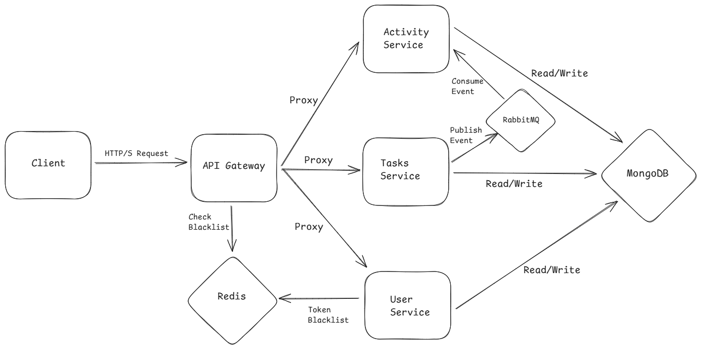

# Project Title: TaskForge - A Distributed Task Management System



## Overview

TaskForge is a robust, scalable, and resilient task management application built on a microservices architecture. This project was developed as a deep-dive into modern backend engineering principles, including distributed systems, event-driven communication, and advanced security patterns. It serves as a comprehensive demonstration of building, testing, and deploying a production-ready backend system.

---

## 🚀 Key Features

- **Microservices Architecture:** Independent services for Users, Tasks, and Activities, promoting modularity and scalability.
- **Centralized API Gateway:** A single, secure entry point for all client requests, handling authentication and routing.
- **Event-Driven Communication:** Decoupled services using RabbitMQ for asynchronous messaging, ensuring high resilience.
- **Robust Security:** JWT-based authentication with refresh tokens, Redis-based token blacklisting, and bcrypt password hashing.
- **Resilience Patterns:** Implemented the Circuit Breaker pattern for external service calls (Redis) to prevent cascading failures.
- **Automated CI/CD Pipeline:** GitHub Actions automatically run integration tests, build Docker images, and deploy services to Render on every push to `main`.
- **Fully Containerized:** All services are containerized with Docker and orchestrated with Docker Compose for a seamless local development experience.

---

## 🛠️ Tech Stack

| Category             | Technology                                       |
| -------------------- | ------------------------------------------------ |
| **Backend**          | Node.js, Express.js                              |
| **Database**         | MongoDB (with Mongoose)                          |
| **Caching**          | Redis                                            |
| **Messaging**        | RabbitMQ                                         |
| **Containerization** | Docker, Docker Compose                           |
| **Testing**          | Jest, Supertest                                  |
| **Authentication**   | JSON Web Tokens (JWT)                            |
| **CI/CD**            | GitHub Actions, GitHub Container Registry (GHCR) |
| **Deployment**       | Render.com                                       |

---

## 🏛️ System Architecture

This project follows a microservices pattern. The diagram below illustrates the flow of communication between the services:


### Service Breakdown:

- **API Gateway:** The public-facing service. It authenticates requests, validates them, and proxies them to the appropriate backend service. It's the only service exposed to the internet.
- **Users Service:** Manages user registration, login, and profile data. It is the source of truth for user information.
- **Tasks Service:** Handles all CRUD (Create, Read, Update, Delete) operations for tasks. When a task is created or updated, it publishes an event to RabbitMQ.
- **Activity Service:** A downstream service that consumes events from RabbitMQ (e.g., `task.created`). It builds a historical log of all activities within the system, providing an audit trail.

---

## ⚙️ Local Development Setup

To run this project locally, you will need [Docker](https://www.docker.com/) and Docker Compose installed.

**1. Clone the repository:**

```bash
git clone https://github.com/gabrielgr15/task-app-backend.git
cd task-app-backend
```

**2. Create Environment Files:**

Each service requires its own `.env` file. Navigate into each service directory (`api-gateway`, `users-service`, etc.) and create a `.env` file. You can use the provided `.env.example` in each folder as a template.

```bash
# Example for users-service
cp users-service/.env.example users-service/.env
# ... now edit users-service/.env with your local settings
```

_(Repeat for all services)_

**3. Run the application:**

The entire stack can be brought up with a single command:

```bash
docker-compose up --build
```

This command will build the Docker images for each service and start the containers. The API Gateway will be available at `http://localhost:8000`.

**4. Running Integration Tests:**

To run the integration tests, you can execute the test command in the `api-gateway` service container:

```bash
docker-compose exec api-gateway npm test
```

---

## 📖 API Endpoints

A brief overview of the main API endpoints available through the API Gateway.

| Method | Endpoint              | Description                           |
| ------ | --------------------- | ------------------------------------- |
| `POST` | `/api/users/register` | Register a new user.                  |
| `POST` | `/api/users/login`    | Log in and receive JWT tokens.        |
| `POST` | `/api/tasks`          | Create a new task.                    |
| `GET`  | `/api/tasks`          | Get all tasks for the logged-in user. |
| `GET`  | `/api/activities`     | Get the activity feed for the user.   |

_(Add more key endpoints as you see fit)_

---

## 🌱 Personal Growth & Learning

This project was a significant learning journey. The `users-service` represents my initial approach, while the `activity-service` reflects a more mature understanding of decoupled, event-driven design. This project taught me invaluable lessons in:

- The challenges of inter-service communication and the importance of a message broker like RabbitMQ.
- Implementing a secure and robust authentication system from scratch.
- The power of containerization for creating reproducible development environments.
- The critical role of a CI/CD pipeline in ensuring code quality and automating deployments.
