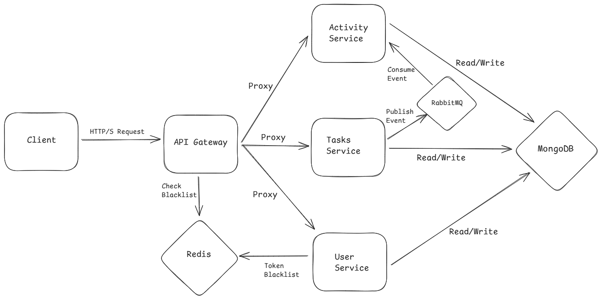

<h1 align="center">Task Hunter</h1>

<p align="center">
  
</p>

<p align="center">
  A deep dive into event-driven, production-grade backend architecture.
</p>

<p align="center">
  <strong><a href="https://tasks-app-frontend-nine.vercel.app" target="_blank" rel="noopener noreferrer">Live Demo</a></strong> &nbsp;&nbsp;&nbsp;|&nbsp;&nbsp;&nbsp;
  <strong><a href="https://github.com/gabrielgr15/task-app-backend" target="_blank">GitHub Repository</a></strong>
</p>

---

## Project Goal

I was motivated by the challenge of building something that reflected the complexity of modern backend systems. Simple CRUD projects weren't enough; I wanted to create a project that would force me to learn and apply key architectural patterns like event-driven design and service decoupling

This project started as a mission to learn critical skills like service decoupling and distributed security, but it grew into a genuine passion for the process of planning, building, and debugging a complex system from the ground up.

---

## Core Architectural Features



-   **Event-Driven & Resilient Communication**
    Initially, I considered direct API calls between services, but learned this creates a fragile system. Instead, key services like Tasks and Activity communicate asynchronously via a **RabbitMQ** event bus. When a task is created, the Tasks Service publishes an event and moves on. If a downstream service is offline, messages queue safely until it recovers. This taught me a powerful lesson in building resilient systems by truly decoupling services.

-   **Security-First Design**
    Authentication uses JWT tokens with bcrypt hashing. A **Redis-backed token blacklist** handles logouts instantly and persists across restarts. The API Gateway acts as a secure shield, validating every request before it reaches the internal network.

-   **True Service Separation**
    Four independent services—API Gateway, Users, Tasks, and Activity—each with its own data persistence. This isolation means a failure in one service (like the Activity logger) does not impact core functionality (like creating tasks).

-   **Containerized & Reproducible Environment**
    The entire stack is defined in `docker-compose.yml`. One command, `docker-compose up`, spins up all services, databases, and the message broker in a clean, predictable state. This is a production-oriented mindset that eliminates "it works on my machine" issues.

-   **Resilience & Production Readiness**
    The system is designed for fault tolerance. Key external calls (like to Redis) are wrapped in a **Circuit Breaker (Opossum)** to prevent cascading failures. Each service uses structured logging with **Winston** and includes a `/health` endpoint for monitoring.

---

## Architecture Decisions & Trade-offs

#### Trade-off: Synchronous API Calls vs. an Event Bus
Synchronous API calls are brittle and tightly coupled. If the Activity Service is slow, the Tasks Service blocks. RabbitMQ decouples them completely. The trade-off is moving from immediate consistency to eventual consistency, which is an acceptable and often desirable pattern for features like activity logging.

#### Trade-off: Using Redis vs. a Database for Caching
Implementing a secure JWT logout requires blacklisting the token until it expires. Querying a primary database on every single authenticated request is too slow. Redis provides the optimal solution: a persistent, high-speed cache for this critical, high-frequency security check.

#### Why Per-Service Databases?
A shared database is an anti-pattern because it creates hidden dependencies. This means a change to the database schema by one service (like tasks-service) could unexpectedly break another service (activity-service) that relies on the old structure. By giving each service its own database, I enforce true isolation. The data for one service is a black box to all others.

---

## Technical Stack

| Category           | Technology & Libraries                                       |
|--------------------|--------------------------------------------------------------|
| **Backend**        | Node.js, Express, TypeScript (in Activity Service)           |
| **Database**       | MongoDB with Mongoose                                        |
| **Messaging**      | RabbitMQ                                                     |
| **Caching**        | Redis                                                        |
| **Authentication** | JWT (Access + Refresh Tokens), bcryptjs                      |
| **Testing**        | Jest, Supertest (for End-to-End Tests)                       |
| **Resilience**     | Opossum (Circuit Breaker), Winston (Logging)                 |
| **Containerization** | Docker, Docker Compose                                     |
| **Frontend**       | Next.js, Tailwind CSS                                        |

---

## Getting Started Locally

**Prerequisites:** Docker & Docker Compose


```bash
# 1. Clone the repository
git clone https://github.com/gabrielgr15/task-app-backend.git
cd task-app-backend

# 2. Set up environment variables for each service using the .env.example files
cp .env.example .env

# 3. Launch the entire stack
docker-compose up --build
```

The frontend is available at `http://localhost:3000` and the API gateway at `http://localhost:4000`.

---

## Project Structure

```
task-hunter/
├── api-gateway/         # Request routing & auth validation
├── user-service/        # User management & authentication
├── e2e-tests/           # End-to-end integration tests for the services
├── tasks-service/       # Task CRUD & event publishing
├── activity-service/    # Event consumption & activity logging
├── frontend/            # Next.js frontend application
├── docker-compose.yml   # Orchestration config
└── README.md
```
---

## API Endpoints Overview

The API Gateway exposes the following key routes, validating JWTs for protected endpoints.

| Method   | Endpoint                  | Service Destination | Description                             |
|----------|---------------------------|---------------------|-----------------------------------------|
| `POST`   | `/api/users/auth/register`| User Service        | Register a new user.                    |
| `POST`   | `/api/users/auth/login`   | User Service        | Log in and receive tokens.              |
| `POST`   | `/api/users/auth/refresh` | User Service        | Refresh an expired access token.        |
| `GET`    | `/api/tasks`              | Tasks Service       | Get all tasks for the logged-in user.   |
| `POST`   | `/api/tasks`              | Tasks Service       | Create a new task.                      |
| `GET`    | `/api/activity`           | Activity Service    | Get the activity feed for the user.     |

---

## What I Learned

**The Critical Importance of Planning:** My single biggest takeaway was the value of architecture and planning. Wrestling with challenges like RabbitMQ's reconnection logic taught me that time spent defining service boundaries, data flows, and communication patterns is paid back tenfold. Once the plan was solid, the act of coding became the straightforward part.

**Containerization is a Necessity:** Docker was non-negotiable for a project this complex. The ability to create a reproducible environment for all services and dependencies with a single command was essential for effective development and debugging.

**Consistency is a Deliberate Trade-off:** I learned that in distributed systems, you consciously trade the safety of a single, all-or-nothing database operation (common in monoliths) for the massive gains in resilience and scalability that an event-driven model provides.

---

## Frontend Note

The frontend's purpose is to be a compelling, functional client for the backend. The visual design is inspired by the aesthetic of *Bloodborne*. Significant effort went into the frontend's visual design to match the Bloodborne aesthetic. This was an iterative process of directing AI tools, sourcing thematic assets, and refining the final result. While I'm proud of the outcome, the primary engineering effort and complexity lie in the backend architecture.


---

## Next Steps & Future Work

This project built a solid foundation. The logical next steps to bring it closer to a production-ready system would be:
-   Implement distributed tracing with a tool like OpenTelemetry to visualize request flows.
-   Add more sophisticated API rate limiting with per-user quotas.

---

*This is a non-commercial, personal portfolio project and is not affiliated with or endorsed by Sony or FromSoftware.*

---

**Connect & Discuss**

[Email](gabrielgomezrojas0501@gmail.com) | [LinkedIn](https://linkedin.com/in/yourprofile)
